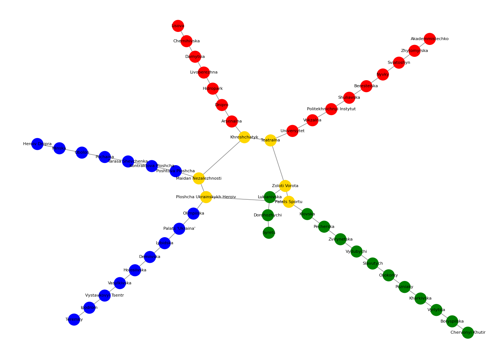

# Kyiv Metro Network Analysis

This project models the Kyiv Metro system using Python and the `networkx` library. The script creates a graph representation of the metro lines, visualizes the network, and compares different pathfinding algorithms (BFS, DFS, and Dijkstra).

## 📋 Prerequisites

To run the script, you need to install the following Python libraries: `networkx`, `matplotlib`, and `scipy`.

You can install them using pip:

```bash
pip install networkx matplotlib scipy
```

## Graph Visualization



## Project Analysis

### 1. Network Topology (Task 1)
The graph represents a simplified model of the metro system with the following characteristics:
* **Nodes (Stations):** 52
* **Edges (Connections):** 52
* **Structure:** The graph consists of 3 linear branches connected at central "hub" stations.
* **Connectivity:** Most stations have a degree of **2** (previous and next station). The central transfer stations (hubs) like *Teatralna* or *Khreshchatyk* have a degree of **3** (two line connections + one transfer connection).

### 2. Pathfinding Comparison: BFS vs. DFS (Task 2)
We calculated the path from **Heroiv Dnipra** (Blue Line) to **Chervonyi Khutir** (Green Line).

* **BFS (Breadth-First Search):** Found a path of 21 steps. BFS guarantees the shortest path in terms of the number of stops.
* **DFS (Depth-First Search):** Found a path of 21 steps.

**Observation:**
In this specific execution, **BFS and DFS returned the exact same path**.
* **Why?** The Kyiv Metro graph has a very simple topology with almost no cycles or loops. Once the algorithm switches from the Blue line to the Green line via the transfer hub, there is only one direction to reach the destination. Therefore, DFS did not "get lost" in a wrong branch and found the same optimal route as BFS.

### 3. Weighted Shortest Path: Dijkstra (Task 3)
We applied Dijkstra's algorithm with the following weights:
* Travel between stations: **2 minutes**
* Transfer between lines: **5 minutes**

**Results:**
* **Path:** Identical to BFS and DFS.
* **Total Weight (Time):** 43 minutes.

### General Conclusions
1.  **Graph Simplicity:** The metro system is a sparse graph. It behaves almost like a tree structure rather than a complex mesh.
2.  **Algorithm Efficiency:** For this specific network, all three algorithms (BFS, DFS, Dijkstra) produced the same route. This indicates that the most direct route (fewest stops) is also the fastest route (lowest weight), and there are no alternative complex detours.
3.  **Hub Importance:** The connectivity of the entire graph relies heavily on the 6 central hub nodes. Removing these connections would split the graph into three disconnected components.