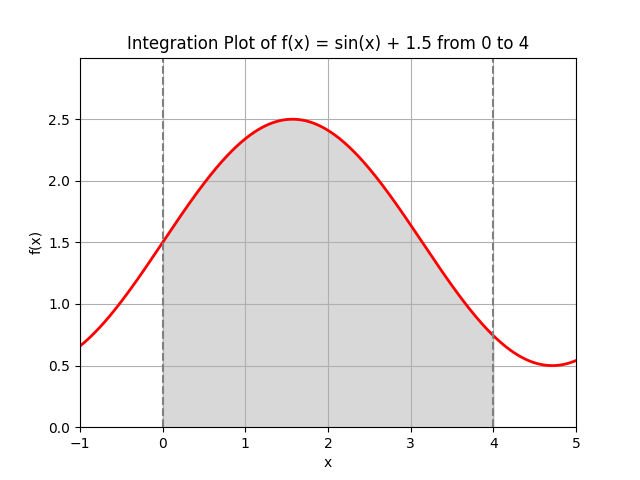

# Integration Method Comparison: Monte Carlo vs. SciPy

## Overview
This project calculates the area under the curve for the function **f(x) = sin(x) + 1.5** within the interval **[0, 4]**.

We used two different methods to find the result:
1.  **Monte Carlo Method:** An estimation based on 100,000 random points.
2.  **SciPy `quad` function:** A precise numerical calculation used as the standard for accuracy.

## Visual Representation
The graph below shows the function and the area we are calculating (shaded in gray).

## Results Comparison

| Method | Calculated Value |
| :--- | :--- |
| **Monte Carlo** | 7.656843 |
| **SciPy (Standard)** | 7.653644 |

## Conclusions

Based on the results above, we can draw the following conclusions:

1.  **Correctness:** The Monte Carlo calculation is **correct**. The result is extremely close to the precise SciPy value.
2.  **Accuracy:** The difference between the two results is approximately **0.0032**. This is a very small error (less than 0.05%), which is expected when using the Monte Carlo method.
3.  **Why they differ:** The SciPy function uses precise mathematical formulas to find the exact answer. The Monte Carlo method uses random sampling to *guess* the answer. Because it relies on randomness, the Monte Carlo result will always fluctuate slightly, but it is a reliable way to estimate integrals when exact formulas are difficult to use.