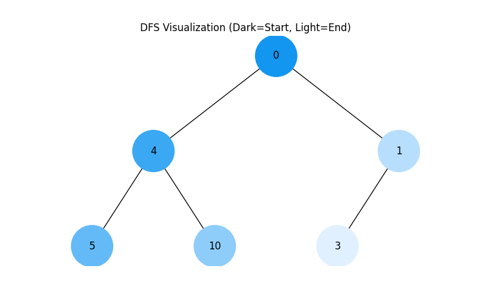
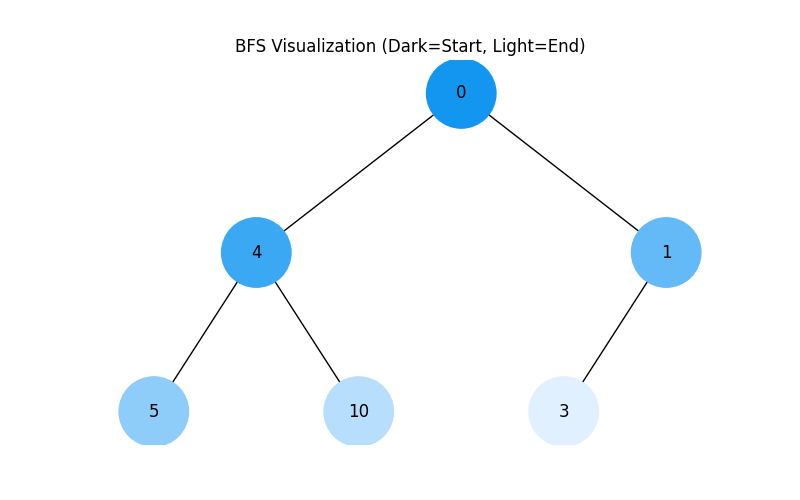

# Binary Tree Traversal Visualization

This project visualizes how two fundamental algorithms navigate through a binary tree: **Depth-First Search (DFS)** and **Breadth-First Search (BFS)**. 

Using Python, we generate a visual representation where the order of visitation is shown through color gradients.

## How to Read the Visualization
* **Color Logic:** The node color indicates the order of visitation.
    * **Dark Blue (#1296F0):** Start (Early nodes).
    * **Light Blue (#E0F0FF):** End (Later nodes).
* **Hex System:** We use a custom function to interpolate colors between the start and end values for a smooth transition.

---

## 1. Depth-First Search (DFS)
**Logic:** Stack (LIFO - Last In, First Out).
In this traversal, the algorithm explores as far as possible along each branch before backtracking. It dives "deep" into the tree first.

* **Implementation:** Iterative approach using a Python list as a Stack.
* **Visual Pattern:** You will see the dark colors flowing down one specific branch to the bottom before appearing on other branches.

---

## 2. Breadth-First Search (BFS)
**Logic:** Queue (FIFO - First In, First Out).
In this traversal, the algorithm explores all neighbor nodes at the present depth prior to moving on to the nodes at the next depth level.

* **Implementation:** Iterative approach using `collections.deque` as a Queue.
* **Visual Pattern:** You will see the colors changing layer by layer. The top is dark, and it gradually becomes lighter as it moves down the tree horizontally.

---

## Requirements
To run the visualization script, the following Python libraries are required:
* `networkx` (for graph creation)
* `matplotlib` (for plotting and colormaps)
* `uuid` (standard library for unique node IDs)