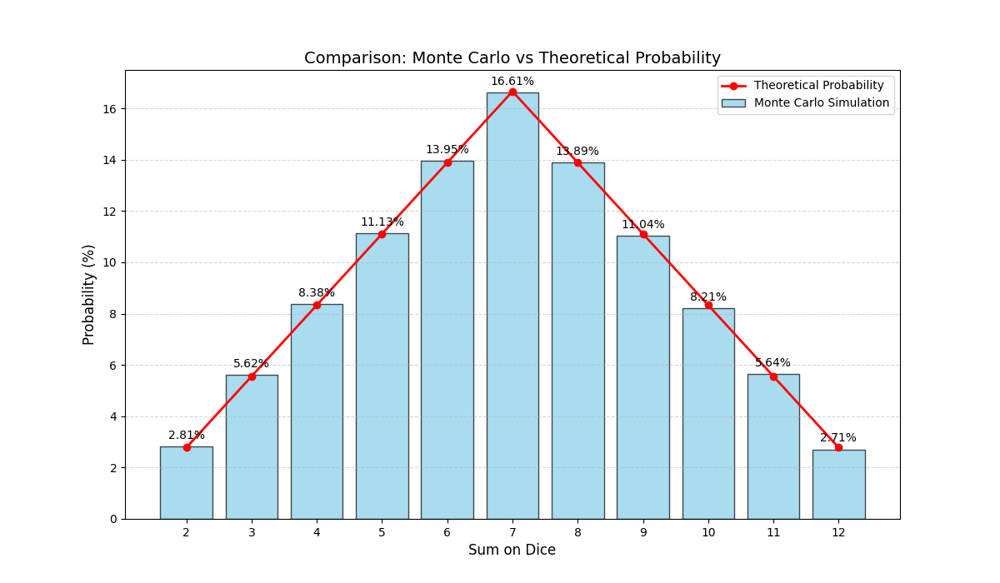

# Monte Carlo Dice Simulation vs. Analytical Probability

This project simulates rolling two 6-sided dice **100,000 times** to analyze the probability of each possible sum (from 2 to 12). 

The goal is to compare the experimental results obtained via the **Monte Carlo method** (random simulation) against the **Theoretical (Analytical) Probability** (exact mathematical calculation).

## 📊 Simulation Results

The following table shows the data from a run of 100,000 simulations. It compares the actual count of rolls against the expected mathematical probability.

| Sum | Count | MC Prob (%) | Theory (%) | Diff (%) |
|:---:|:-----:|:-----------:|:----------:|:--------:|
| **2** | 2,815 | 2.81 | 2.78 | +0.037 |
| **3** | 5,623 | 5.62 | 5.56 | +0.067 |
| **4** | 8,382 | 8.38 | 8.33 | +0.049 |
| **5** | 11,132 | 11.13 | 11.11 | +0.021 |
| **6** | 13,948 | 13.95 | 13.89 | +0.059 |
| **7** | 16,610 | 16.61 | 16.67 | -0.057 |
| **8** | 13,889 | 13.89 | 13.89 | +0.000 |
| **9** | 11,042 | 11.04 | 11.11 | -0.069 |
| **10**| 8,211 | 8.21 | 8.33 | -0.122 |
| **11**| 5,637 | 5.64 | 5.56 | +0.081 |
| **12**| 2,711 | 2.71 | 2.78 | -0.067 |

## 📈 Visual Representation

The graph below visualizes the distribution of sums. The bars (with numbers) represent the simulation, while the line represents the theoretical ideal.

## 🧐 Comparative Report & Conclusions

### 1. Accuracy of the Simulation
The Monte Carlo method proved to be highly accurate with a sample size of 100,000 rolls. 
* **Minimal Error:** The difference between the simulation (`MC Prob`) and the math (`Theory`) was extremely small for all sums.
* **Maximum Deviation:** The largest error was only **0.122%** (for the sum of 10).
* **Perfect Match:** The sum of 8 matched the theoretical probability almost perfectly (+0.000% difference).

### 2. Distribution Shape
Both the simulation and the analytical method follow a **Triangular Distribution** (or a discrete Normal Distribution approximation):
* **Most Frequent:** The number **7** is the most likely result (approx. 16.6%).
* **Least Frequent:** The numbers **2** and **12** are the least likely (approx. 2.7%).
* The probability increases steadily from 2 to 7 and decreases symmetrically from 7 to 12.

### 3. Conclusion
The simulation successfully demonstrates the **Law of Large Numbers**. As we increased the number of trials to 100,000, the experimental results converged with the theoretical probabilities. The random noise (fluctuations) was negligible, making this Python program a reliable tool for modeling probability.